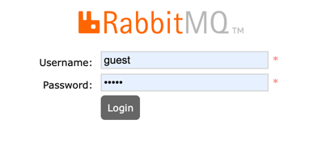
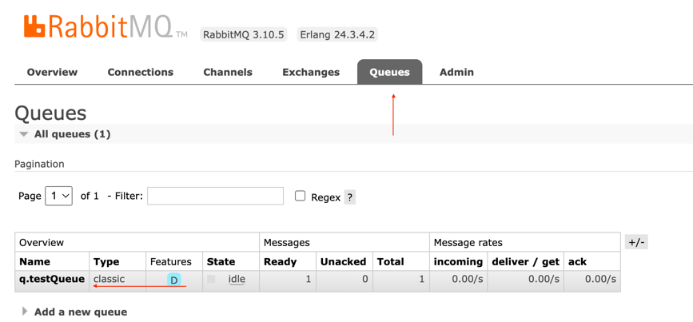
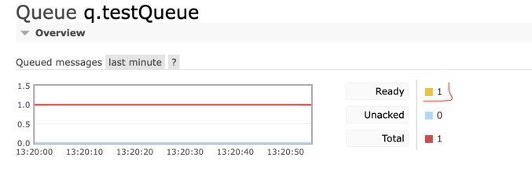
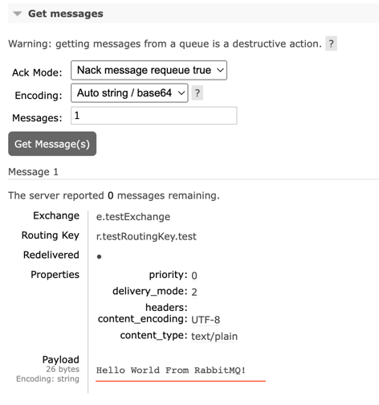

# RabbitMQ - Spring Boot AMQP

### Introduction

This is a basic implementation for a Rabbit MQ producer using the AMQP Spring boot abstraction layer.

### Pre requisites
- Docker
- Docker Compose
- Java 11
- Gradle > 7

### Guide

1. First run the command `docker compose up` under the folder `/resources`. This command will run a RabbitMQ console to check the message published.
2. Run the spring boot application from the class `RabbitMQProducerApplication` with no additional parameters.
3. Do a GET request to `localhost:8080/send` via Postman/Insomnia or even a web browser like Chrome.

### See the Message on RabbitMQ Console

1. Open a tab on `localhost:15672` to open the RabbitMQ console and use the following credentials:
- **Username**: guest
- **Password**: guest

2. Go to `Queues` and click under the queue created by the Spring Boot application when hit the `send` request

3. If everything goes as expected, you will have 1 or more message on `Ready`

4. Click on `Get Message` to check the message published by the application.

